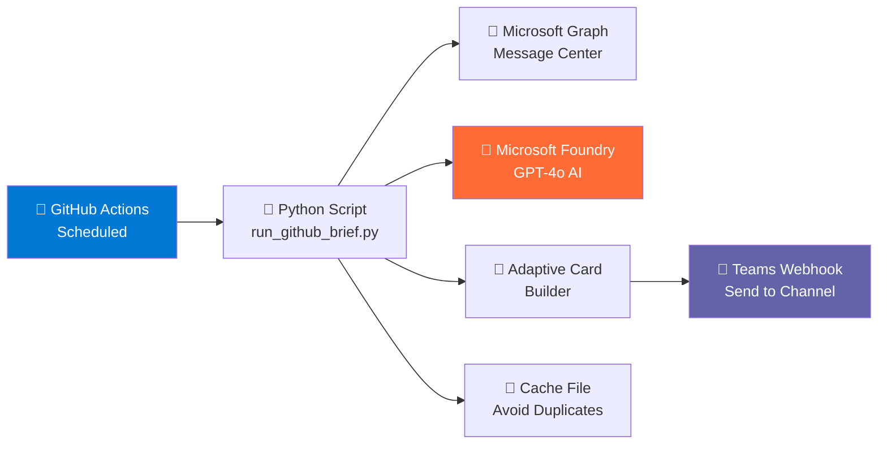
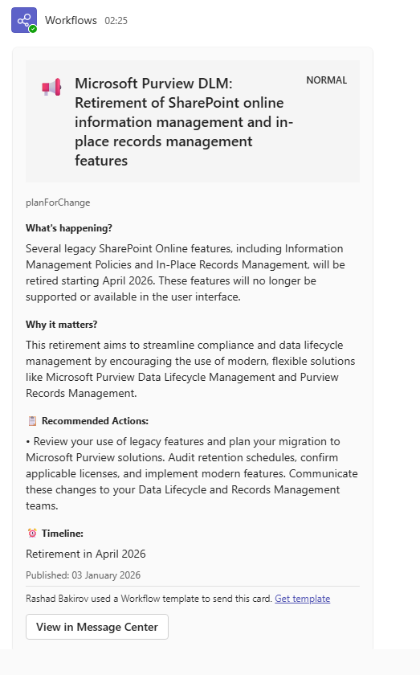
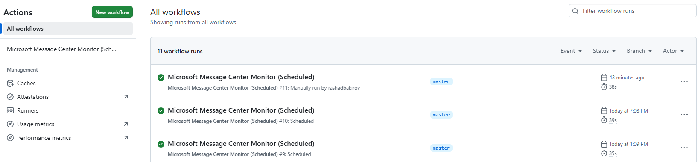
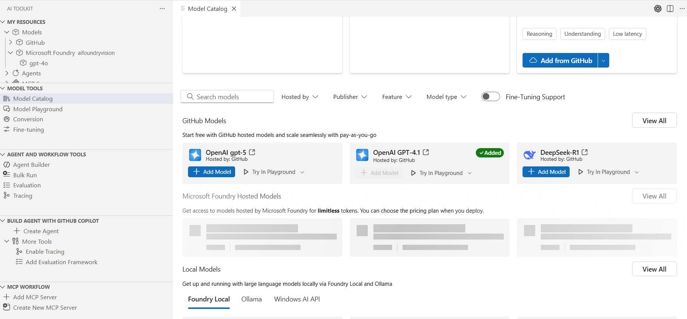
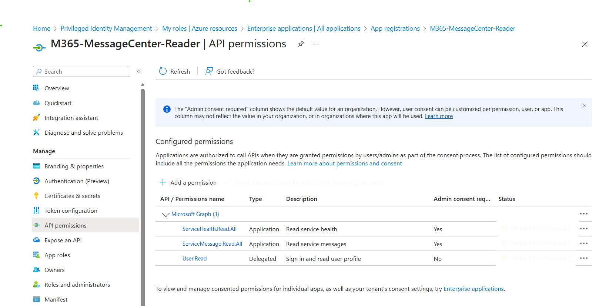

# Microsoft Message Center Monitor 🚀

**Never miss critical Microsoft 365 updates again.**

Automatically monitor your Microsoft 365 Message Center, get AI-powered summaries of what matters, and receive them directly in Microsoft Teams. Perfect for IT pros and system administrators who need to stay informed about service changes, maintenance windows, and important announcements.

---

## ✨ What You Get

- **Automated Monitoring** – Checks for new announcements every 6 hours (configurable)
- **AI Summaries** – Uses Microsoft Foundry (Azure OpenAI) to create clear, actionable summaries
- **Teams Integration** – Posts beautiful Adaptive Cards directly to your Teams channel
- **Service Health Alerts** – Sends Microsoft 365 Service Health incidents alongside Message Center updates
- **Smart Deduplication** – Never sends the same announcement twice
- **Optional Notifications** – Get notified even when there's no news (or turn it off)

---

## 🎯 Before You Start

**What you'll need:**
- ✅ Microsoft 365 tenant with Message Center access
- ✅ Azure subscription (with Microsoft Foundry / Azure OpenAI available)
- ✅ Microsoft Teams channel for announcements
- ✅ GitHub repository (to host and run this automation)

**Time to setup:** ~20-30 minutes for first-time users

**Cost estimate:** GPT-4o costs per request are minimal (fractions of a cent). Since this runs 4 times daily, you can calculate costs based on [Azure pricing](https://azure.microsoft.com/en-us/pricing/details/cognitive-services/openai-service/) for your region

---

## 🚀 Quick Start (5 Steps)

### Step 1: Clone This Repository

Open your terminal (Command Prompt, PowerShell, or Bash) and run:

```bash
# Clone the repository
git clone https://github.com/rashadbakirov/MS-Message-Center-Monitor.git

# Navigate into the folder
cd MS-Message-Center-Monitor
```

**Tip:** If you want to maintain your own version, fork this repo first, then clone your fork instead.

### Step 2: Set Up Microsoft Foundry (Azure OpenAI)

This is where the AI magic happens. Your announcements will be summarized here.

**Choose your setup method:**

**Option A: Microsoft Foundry (Recommended)**
1. Go to [ai.azure.com](https://ai.azure.com) (Microsoft Foundry)
2. Click **Create deployment**
3. Select **GPT-4o** or **gpt-4o-mini** (budget option)
4. Copy the endpoint and API key

**Option B: Azure Portal**
1. Open [Azure Portal](https://portal.azure.com)
2. Search for "Azure OpenAI" → Create new resource
3. Deploy a model (GPT-4o recommended)
4. Copy endpoint and API key

**Option C: Visual Studio Code**
1. Install the [Azure AI Toolkit](https://marketplace.visualstudio.com/items?itemName=ms-windows-ai-studio.windows-ai-studio)
2. Connect to your OpenAI resource
3. Copy credentials from the extension

👉 **[Full setup guide](docs/SETUP.md#step-2-set-up-microsoft-foundry-azure-openai-)**

### Step 3: Create Teams Webhook

This tells the app where to send notifications.

1. Open **Microsoft Teams**
2. Go to the channel where you want announcements
3. Click **⋯** (three dots) → **Workflows** → **Send webhook alerts to a channel**
4. Click **Create** and name it `Message Center Monitor`
5. Copy the generated **webhook URL**

This URL is your `TEAMS_WEBHOOK_URL` – keep it private!

👉 **[Full setup guide](docs/SETUP.md#step-3-create-teams-webhook-power-automate-workflow-)**

### Step 4: Register Your App (Azure App Registration)

This gives the app permission to read your Message Center.

1. Go to [Azure Portal](https://portal.azure.com) → **App registrations**
2. Click **New registration**
3. Name: `Microsoft Message Center Monitor`
4. Add Microsoft Graph permissions: `ServiceMessage.Read.All` and `ServiceHealth.Read.All`
5. Create a client secret and copy it
6. Save the App ID and Tenant ID

These permissions also enable Service Health incident messages (no extra setup required).

👉 **[Full setup guide](docs/SETUP.md#step-4-register-your-app-azure-app-registration-)**

### Step 5: Add GitHub Secrets and Run

1. Go to your GitHub repository → **Settings** → **Secrets and variables** → **Actions**
2. Add these secrets (one by one):
   - `AZURE_TENANT_ID`
   - `MC_APP_ID`
   - `MC_CLIENT_SECRET`
   - `AZURE_OPENAI_ENDPOINT`
   - `AZURE_OPENAI_API_KEY`
   - `AZURE_OPENAI_DEPLOYMENT`
   - `AZURE_OPENAI_API_VERSION`
   - `TEAMS_WEBHOOK_URL`

3. Go to **Actions** tab → Select **"Microsoft Message Center Monitor (Scheduled)"** → Click **Run workflow**
4. Check your Teams channel – you should see your first card! 🎉

👉 **[Complete setup checklist](docs/SETUP.md)**

---

## 🧭 How It Works (Under the Hood)

Here's the journey of your announcements:



**What happens every run:**
1. **GitHub Actions** wakes up and runs your script (6 hours apart by default)
2. **Python script** fetches recent announcements from your Microsoft 365 Message Center via Microsoft Graph
3. **Microsoft Foundry** reads each announcement and creates a short, clear summary
4. **Card builder** formats everything into a beautiful Teams card
5. **Teams webhook** posts the card to your channel
6. **Cache file** remembers what was sent to avoid duplicates

👉 **[Deep dive into architecture](docs/ARCHITECTURE.md)**

---

## 💰 Cost & Model Options

### GPT-4o (Recommended)
- **Cost:** See [Azure pricing](https://azure.microsoft.com/en-us/pricing/details/cognitive-services/openai-service/) per request
- This runs **4 times daily** = calculate based on your pricing tier
- **Pros:** Better accuracy, excellent context understanding

### gpt-4o-mini (Budget Option)
- **Cost:** Lower per-request cost
- **Pros:** Cheaper alternative
- **Cons:** Slightly less powerful

**Switch models anytime:** Edit the `AZURE_OPENAI_DEPLOYMENT` secret in GitHub settings

---

## 📸 See It In Action

**Here's what a Teams announcement looks like:**



**GitHub Actions running automatically:**



---

## ⚙️ Customize & Troubleshoot

| Want to... | Go to... |
|-----------|----------|
| Change how often it runs | [DEPLOYMENT.md](docs/DEPLOYMENT.md#change-the-schedule) |
| See logs & debug issues | [TROUBLESHOOTING.md](docs/TROUBLESHOOTING.md) |
| Understand the code structure | [ARCHITECTURE.md](docs/ARCHITECTURE.md) |
| Learn about polling intervals | [POLLING_INTERVALS_EXPLAINED.md](docs/POLLING_INTERVALS_EXPLAINED.md) |

---

## 🧰 Tech Stack

- **Language:** Python 3.11+
- **Scheduler:** GitHub Actions
- **AI Model:** Microsoft Foundry (Azure OpenAI)
- **APIs:** Microsoft Graph, Teams Workflows
- **License:** MIT (use freely, including commercially!)

---

## 🤝 Contributing

Found a bug? Have an idea? Feel free to:
- Open an issue
- Submit a pull request
- Share feedback

---

## 📄 License

MIT License – See [LICENSE](LICENSE) for details.

---

## 🆘 Need Help?

- **Setup questions?** Check [docs/SETUP.md](docs/SETUP.md)
- **Something not working?** See [docs/TROUBLESHOOTING.md](docs/TROUBLESHOOTING.md)
- **Want to understand the code?** Read [docs/ARCHITECTURE.md](docs/ARCHITECTURE.md)

---

**Happy monitoring! 🎉** Your teams will stay informed about every important Microsoft 365 change.




## 🧯 Troubleshooting
See [docs/TROUBLESHOOTING.md](docs/TROUBLESHOOTING.md).

## 🤝 Contributing
See [.github/CONTRIBUTING.md](.github/CONTRIBUTING.md).

## 📄 License
MIT. See [LICENSE](LICENSE).

## 📫 Support
- Issues: https://github.com/rashadbakirov/MS-Message-Center-Monitor/issues
- Discussions: https://github.com/rashadbakirov/MS-Message-Center-Monitor/discussions
