# Architecture 🧱

This document explains **how the app works** and **why it's built this way**.

---

## 🎯 The Big Picture

Microsoft Message Center Monitor is a **lightweight automation pipeline** that runs on GitHub Actions. Here's what it does:

1. **Wakes up** every 6 hours (on a schedule)
2. **Fetches** new announcements from your Microsoft 365 Message Center
3. **Summarizes** each one using AI (Microsoft Foundry / GPT-4o)
4. **Formats** them into pretty Teams cards
5. **Posts** them to your Teams channel
6. **Remembers** what it sent (to avoid duplicates)

The whole process takes **less than a minute** and costs just a few cents.

---

## 🔄 Data Flow Diagram

```mermaid
flowchart LR
  A["⏰ GitHub Actions<br/>Scheduler"] -->|Every 6 hrs| B["🐍 Python<br/>run_github_brief.py"]
  
  B -->|Fetch recent items| C["📢 Microsoft Graph<br/>Message Center API"]
  C -->|JSON announcements| B
  
  B -->|For each item| D["🤖 Microsoft Foundry<br/>GPT-4o LLM"]
  D -->|Summary text| B
  
  B -->|Build card| E["🎨 Adaptive Card<br/>Builder"]
  E -->|Card JSON| B
  
  B -->|Post card| F["💬 Teams Webhook<br/>Power Automate"]
  F -->|POST request| G["👥 Teams Channel<br/>Your Team"]
  
  B -->|Cache results| H["💾 Sent IDs<br/>gh_sent_ids.json"]
  H -->|Check for duplicates| B
  
  style A fill:#0078d4,color:#fff
  style D fill:#ff6b35,color:#fff
  style G fill:#6264a7,color:#fff
```



---

## 📦 What Happens at Each Step

### Step 1: Schedule (GitHub Actions)

**File:** `.github/workflows/brief-schedule.yml`

- Runs on a cron schedule: `0 */6 * * *` (every 6 hours)
- Can be manually triggered from the GitHub Actions tab
- Runs in a clean Ubuntu environment with Python 3.11+

```yaml
# Example cron schedule
0 */6 * * *      # Every 6 hours
0 9 * * MON-FRI  # Weekdays at 9 AM
0 0 * * *        # Daily at midnight
```

**Why GitHub Actions?**
- No extra servers to run
- Completely free for public repos
- Easy to monitor and debug
- Built-in secrets management

---

### Step 2: Python Entry Point

**File:** `scripts/run_github_brief.py`

This is the main script that orchestrates everything. It:

1. Loads secrets from GitHub Actions environment variables
2. Fetches recent announcements from Microsoft Graph
3. For each new announcement (not sent before):
   - Sends it to Microsoft Foundry for AI summarization
   - Builds a Teams Adaptive Card with the summary
   - Posts the card to Teams via webhook
4. Updates the cache file (`data/gh_sent_ids.json`) to remember what was sent

**Key logic:**
```python
# Pseudo-code showing the flow
announcements = fetch_from_message_center()
for announcement in announcements:
    if not already_sent(announcement.id):
        summary = summarize_with_ai(announcement)
        card = build_adaptive_card(announcement, summary)
        post_to_teams(card)
        cache_sent_id(announcement.id)
```

---

### Step 3: Fetch Announcements (Microsoft Graph)

**File:** `src/agent/tools/message_center.py`

Uses **Microsoft Graph API** to read your Message Center.

**What it does:**
- Authenticates using your app registration credentials
- Queries the Message Center service health API
- Returns announcements from the last 24 hours (or your configured lookback)
- Returns raw data: title, body, impact level, etc.

**Authentication flow:**
```
Your app registration credentials
    ↓
Azure AD authentication
    ↓
Access token received
    ↓
Call Microsoft Graph API
    ↓
Get announcements
```

**Why this approach?**
- Official Microsoft API (reliable and documented)
- Application permissions (no user login needed)
- Can run unattended on GitHub Actions

---

### Step 4: Summarize with AI (Microsoft Foundry)

**File:** `src/agent/tools/ai_enricher.py`

Uses **Microsoft Foundry (Azure OpenAI)** to create summaries.

**What it does:**
- Takes a raw announcement (often long and technical)
- Sends it to GPT-4o with a prompt asking for:
  - **What changed?** (the key change)
  - **Why does it matter?** (the impact)
  - **What should I do?** (the action required)
- Returns a concise, human-readable summary

**Example:**
```
Raw announcement (200+ words):
"Microsoft Exchange Online has announced a change to how 
mail retention policies are calculated in hybrid environments..."

↓ (via GPT-4o)

Summary (50 words):
"Hybrid mail retention policies will now be calculated differently. 
This may affect archival for hybrid setups. Review your policies 
in the Exchange admin center."
```

**Cost breakdown:**
- Each summary call: ~0.01 cents
- 5 announcements/day × 30 days = ~1.50 dollars/month
- Plus: baseline Azure OpenAI costs (~$0/month for low usage)

---

### Step 5: Build Adaptive Card

**File:** `src/connectors/adaptive_card_builder.py`

Formats the announcement + summary into a Teams Adaptive Card.

**What it creates:**
```json
{
  "type": "AdaptiveCard",
  "body": [
    { "type": "TextBlock", "text": "Announcement Title", "weight": "bolder" },
    { "type": "TextBlock", "text": "Summary from AI", "wrap": true },
    { "type": "FactSet", "facts": [
      { "name": "Impact:", "value": "Critical" },
      { "name": "Deadline:", "value": "Jan 15, 2026" }
    ]}
  ]
}
```

**Visual result in Teams:**
- Bold title
- Color-coded impact level (red = critical, yellow = important)
- AI-written summary with key facts
- Link to the full announcement in Microsoft 365

---

### Step 6: Post to Teams (Webhook)

**File:** `src/agent/tools/teams_connector.py`

Sends the Adaptive Card to your Teams channel.

**What it does:**
- Takes the card JSON from the previous step
- POSTs it to your Teams Workflows webhook URL
- Handles errors (retry if needed, log if failed)

**Why a webhook?**
- No authentication needed (webhook URL is the credential)
- One-way communication (app posts, doesn't receive)
- Simple HTTP POST request
- Can be called from anywhere (GitHub, local machine, cloud function, etc.)

---

### Step 7: Cache Management

**File:** `data/gh_sent_ids.json`

Keeps track of announcements already sent to avoid duplicates.

**Format:**
```json
{
  "sent_ids": [
    "announcement-id-1",
    "announcement-id-2",
    "announcement-id-3"
  ]
}
```

**Why needed?**
- Message Center API might return the same items on consecutive runs
- Without this cache, you'd get duplicate cards in Teams
- The cache is stored in the repo so it persists across runs

---

## 🔐 Security Architecture

### Secrets Management

```
Your credentials (stored securely)
    ↓
GitHub Secrets (encrypted, not in code)
    ↓
GitHub Actions environment variables
    ↓
Python script reads from environment
    ↓
API calls made with credentials
    ↓
Log files: NO SECRETS PRINTED
```

**Important:**
- Secrets are never printed to logs
- Never commit `.env` files with real credentials
- Webhook URL is treated as a password
- API keys are rotated every 1-2 years

---

## 📊 Performance & Scale

| Metric | Value |
|--------|-------|
| **Runtime per execution** | ~30-60 seconds |
| **API calls per run** | 2-3 (depending on announcement count) |
| **Cost per run** | ~1-3 cents |
| **Throughput** | ~50 announcements/day supported |
| **Scalability** | Can be adapted to hundreds with queue-based approach |

---

## 🛠️ Why This Architecture?

### ✅ Advantages

1. **Simple** – Easy to understand and maintain
2. **Serverless** – No infrastructure to manage
3. **Cost-effective** – Pay only for what you use
4. **Reliable** – GitHub Actions + Microsoft APIs = high uptime
5. **Secure** – No public endpoints, webhook-based delivery
6. **Extensible** – Easy to add features (e.g., Slack integration)

### ⚠️ Limitations

1. **Limited frequency** – 6 hours is a reasonable minimum (to avoid Azure overages)
2. **Single channel** – Currently posts to one Teams channel (can be duplicated for multiple)
3. **No feedback loop** – App doesn't track if users read the messages
4. **No prioritization** – All announcements are treated equally

---

## 🔄 Alternative Architectures (Why We Didn't Use Them)

### Option A: Azure Function (with Timer Trigger)
- **Pro:** More control, could run every minute
- **Con:** Extra Azure costs, more complex deployment
- **Why not:** GitHub Actions is simpler for this use case

### Option B: Azure Logic App
- **Pro:** Visual workflow builder
- **Con:** Harder to test locally, more expensive
- **Why not:** Python code is easier to maintain

### Option C: Microsoft Teams Bot
- **Pro:** Direct Teams integration
- **Con:** Requires hosting, authentication overhead
- **Why not:** Webhook approach is simpler and more secure

---

## 📈 How to Extend This

Want to add features? Here are some ideas:

### Route to Multiple Teams Channels
```python
# Modify teams_connector.py to post to different channels based on impact
if announcement.impact == "critical":
    post_to_teams(CRITICAL_WEBHOOK_URL)
else:
    post_to_teams(GENERAL_WEBHOOK_URL)
```

### Add Slack Integration
```python
# Add slack_connector.py
from slack_sdk import WebClient
client = WebClient(token=SLACK_TOKEN)
client.chat_postMessage(channel="#updates", blocks=card)
```

### Add Email Notifications
```python
# Add email_connector.py using sendgrid or Microsoft Graph
send_email(recipients, subject, summary)
```

### Change the AI Model
```python
# In ai_enricher.py, swap OpenAI for another provider
client = AnthropicClient()  # or Cohere, or HuggingFace
response = client.messages.create(model="claude-3")
```

---

## 🧪 Testing Locally

### Run the script locally:
```bash
# Create a .env file with your credentials
python scripts/run_github_brief.py

# Or with environment variables
export AZURE_TENANT_ID="..."
export MC_APP_ID="..."
# ... (set all others)
python scripts/run_github_brief.py
```

### Run unit tests:
```bash
pytest tests/unit/
```

### Run integration tests:
```bash
pytest tests/integration/
```

---

## 📚 Further Reading

- [Microsoft Graph Message Center API](https://learn.microsoft.com/graph/api/serviceupdatemessage-list)
- [Azure OpenAI API Reference](https://learn.microsoft.com/azure/ai-services/openai/reference)
- [Teams Webhooks Documentation](https://learn.microsoft.com/microsoftteams/platform/webhooks-and-connectors/how-to/connectors-using)
- [GitHub Actions Documentation](https://docs.github.com/en/actions)

---

**Questions?** Check [TROUBLESHOOTING.md](TROUBLESHOOTING.md) or open an issue on GitHub.
